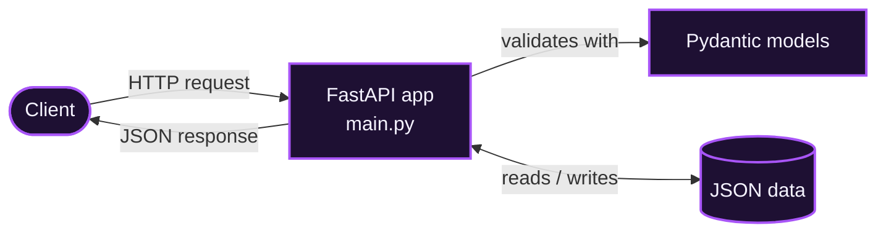

<div align="center">


[](https://github.com/Suman18-bit)

---


</div>


## ✨ Overview

A hands-on project for exploring how **FastAPI** and **Pydantic** work together. It pairs a FastAPI application with Pydantic models and sample JSON data for **patient** and **student** records.

- ⚡ **FastAPI app** with automatically generated, interactive API docs
- ✅ **Pydantic models** for patient and student data
- 🗂️ **JSON sample data**, so there's no database to set up
- 🐍 **Reproducible setup**: Python version pinned in `.python-version`, dependencies in `pyproject.toml`

## 🧩 How It Works



## 📁 Project Structure

```
FastAPI/
├── FastAPI/
│   └── main.py               # FastAPI application
├── Pydantic/
│   ├── Patients.py           # Patient model
│   ├── Student.py            # Student model
│   ├── pydt.py               # Pydantic examples
│   ├── patients_data.json    # Sample patient data
│   └── students_data.json    # Sample student data
├── Data.json                 # Sample data
├── patients_data.json        # Sample patient data
├── new.md                    # Notes
├── New.mmd.txt               # Mermaid diagram source
├── pyproject.toml            # Project metadata & dependencies
├── .python-version           # Pinned Python version
├── .gitignore
└── README.md
```

## 🚀 Getting Started

### Prerequisites

- Python (the version is pinned in `.python-version`)
- `pip`, or [uv](https://docs.astral.sh/uv/)

### Installation

```bash
# Clone the repository
git clone https://github.com/Suman18-bit/<repo-name>.git
cd <repo-name>

# Create a virtual environment
python -m venv .venv
```

Activate it:

```bash
# Windows
.venv\Scripts\activate

# macOS / Linux
source .venv/bin/activate
```

Install the dependencies:

```bash
pip install fastapi "uvicorn[standard]" "pydantic[email]"
```

<details>
<summary><b>Prefer uv?</b></summary>

```bash
uv sync
```

</details>

### Run the API

```bash
cd FastAPI
uvicorn main:app --reload
```

Once the server is up, open the interactive docs:

| Docs | URL |
|------|-----|
| Swagger UI | http://127.0.0.1:8000/docs |
| ReDoc | http://127.0.0.1:8000/redoc |

### Try the Pydantic examples

Each script in `Pydantic/` can be run on its own:

```bash
python Pydantic/Patients.py
python Pydantic/Student.py
```

## 👨‍💻 Author

**Suman Seth**

[](https://github.com/Suman18-bit)
[](https://linkedin.com/in/suman-seth-b05417324)

---

<div align="center">

⭐ If you found this useful, consider starring the repo!


</div>
